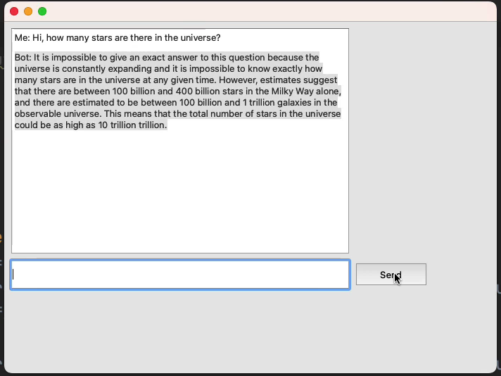

# ChatGPTChatbot

## Table of Contents
- [Introduction](#introduction)
- [Features](#features)
- [Visual](#visual)
- [Prerequisites](#prerequisites)
- [Installation](#installation)

  
## Introduction

Welcome to the ChatGPT Desktop App! This user-friendly desktop application allows you to interact with the OpenAI GPT-3.5 language model to create a powerful chatbot experience. Whether you're looking for assistance, a conversation partner, or just want to explore the capabilities of GPT-3.5, this app has got you covered.

## Features

- **Natural Language Understanding:** Utilize the state-of-the-art GPT-3.5 model to have human-like conversations.
- **User-Friendly GUI:** An intuitive and easy-to-use graphical user interface for a seamless chatbot experience.
- **Customizable Responses:** You can fine-tune and customize the chatbot's responses to suit your needs, in the python script.
- **Multi-Platform Support:** Available on Windows, macOS, and Linux.

## Visual



## Prerequisites

See requirements.txt 
Before you get started with the ChatGPT Desktop App, make sure you have the following prerequisites installed:

- Python 3.6 or higher
- OpenAI Python library (`openai`): You can install it using pip.

## Installation

To install and run the ChatGPT Desktop App, follow these steps:

1. Clone the repository from GitHub:
   ```bash
   git clone https://github.com/Matthew-Oj/ChatGPTChatbot.git

  
Run install: 
   ```bash
   pip install openai

